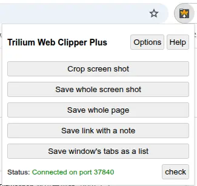
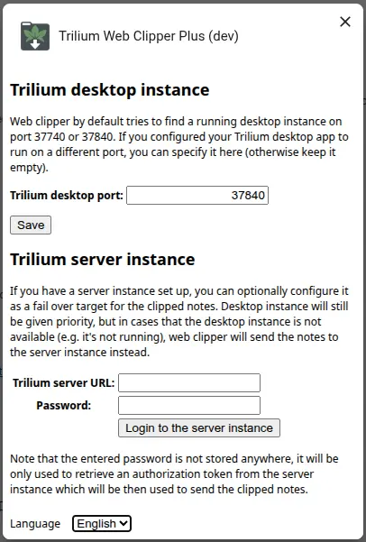

# Trilium Web Clipper Plus

[中文说明](README_CN.md)

[Get it on Chrome Web Store](https://chromewebstore.google.com/detail/trilium-web-clipper-plus/adkalonadklcbfpfgfjhkgaopdpljlkj)

> 💡 *Take a quick break and stretch if you've been sitting too long :)*

## ✨ Overview

**Trilium Web Clipper Plus** is an enhanced browser extension for [Trilium Notes](https://github.com/zadam/trilium), designed to let you easily clip selected text, screenshots, full web pages, or quick notes—right into your Trilium workspace.

This project is a fork of [zadam/trilium-web-clipper](https://github.com/zadam/trilium-web-clipper), with added features and updates by **Nriver**.

## 🚀 Key New Features

* ✔️ Compatible with Chrome Manifest V3
* 🌐 Internationalization (i18n) support
* 🔄 Auto clip
* 🔧 Bug fixes and improvements
* 🆕 New name and logo
* ✨ Option to include URL in note content when saving link with a note

If you find this project helpful, please consider [supporting my work](#donation). Thank you!

## 📸 Screenshots

### Extension Popup Interface

### Clipping Options and Settings

## ⌨️ Keyboard Shortcuts

Use these default shortcuts for quick clipping:

| Action             | Windows / Linux | macOS         |
| ------------------ | --------------- | ------------- |
| Save selected text | `Ctrl+Shift+S`  | `Cmd+Shift+S` |
| Save full page     | `Alt+Shift+S`   | `Opt+Shift+S` |
| Save screenshot    | `Ctrl+Shift+E`  | `Cmd+Shift+E` |

> 🔧 Customize shortcuts in your browser settings:
> **Chrome**: `chrome://extensions/shortcuts`

## 🙏 Donation

If you enjoy using **Trilium Web Clipper Plus**, your support would mean a lot!

**Ko-fi**

**Alipay**

**WeChat Pay**

## 📌 Credits

This extension is based on the original [Trilium Web Clipper](https://github.com/zadam/trilium-web-clipper) by [zadam](https://github.com/zadam)—huge thanks for his outstanding work on Trilium Notes!

Portions of the code are also inspired by the [Joplin Notes Clipper](https://github.com/laurent22/joplin/tree/master/Clipper).

---

## 📝 License

This project is licensed under the **GNU Affero General Public License version 3 (AGPLv3)**.

See the [LICENSE](./LICENSE) file for details.

---

This project includes code originally licensed under the **MIT License** by the original author(s).  
Their copyright and permission notices are preserved in the [LICENSE.MIT](./LICENSE.MIT) file and within the source files.

By using this project, you agree to comply with the terms of the AGPLv3 license while respecting the original MIT license terms for the included code.

For more information about AGPLv3, see: [https://www.gnu.org/licenses/agpl-3.0.html](https://www.gnu.org/licenses/agpl-3.0.html)
