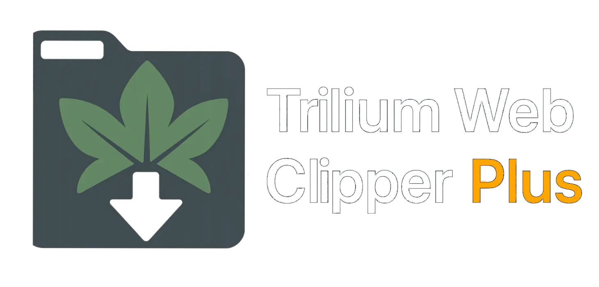
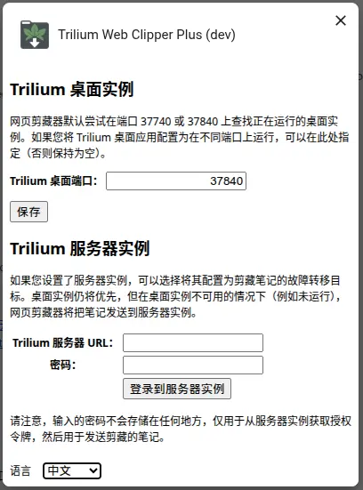

# Trilium Web Clipper Plus

[English README](README.md)

[Chrome应用商店下载链接](https://chromewebstore.google.com/detail/trilium-web-clipper-plus/adkalonadklcbfpfgfjhkgaopdpljlkj)

> 💡 *如果你已经坐了很久，不妨起来活动一下身体 :)*

## ✨ 简介

**Trilium Web Clipper Plus** 是一个增强版的浏览器扩展，适用于 [Trilium Notes](https://github.com/zadam/trilium)，可帮助你快速剪藏选中的文本、网页截图、整个页面或快速笔记，并直接保存到 Trilium 中。

该项目是从 [zadam/trilium-web-clipper](https://github.com/zadam/trilium-web-clipper) 分支而来，由 **Nriver** 添加功能和优化改进。

## 🚀 主要新特性

* ✔️ 兼容 Chrome Manifest V3
* 🌐 支持国际化（i18n）
* 🔄 自动剪藏
* 🔧 修复了一些已知问题
* 🆕 更换了名称和 Logo

如果你觉得这个项目对你有帮助，欢迎[赞助支持](#捐赠)。非常感谢！

## 📸 截图展示

### 扩展弹窗界面

### 剪藏选项和设置

## ⌨️ 快捷键说明

以下是默认快捷键设置，方便你快速剪藏内容：

| 操作     | Windows / Linux | macOS         |
| ------ | --------------- | ------------- |
| 保存选中文本 | `Ctrl+Shift+S`  | `Cmd+Shift+S` |
| 保存整个网页 | `Alt+Shift+S`   | `Opt+Shift+S` |
| 保存网页截图 | `Ctrl+Shift+E`  | `Cmd+Shift+E` |

> 🔧 你可以在浏览器中自定义快捷键：
> **Chrome**：`chrome://extensions/shortcuts`

## 🙏 捐赠

如果你喜欢使用 **Trilium Web Clipper Plus**，欢迎支持我的开发工作！

**Ko-fi**

**支付宝**

**微信支付**

## 📌 致谢

本扩展基于原始项目 [Trilium Web Clipper](https://github.com/zadam/trilium-web-clipper)，感谢作者 [zadam](https://github.com/zadam) 为 Trilium Notes 所做的出色工作！

部分代码也参考了 [Joplin Notes 浏览器剪藏扩展](https://github.com/laurent22/joplin/tree/master/Clipper)。

---

## 📝 许可证说明

本项目整体采用 **GNU Affero General Public License 第3版 (AGPLv3)** 许可发布。

详情请参见项目根目录的 [LICENSE](./LICENSE) 文件。

---

项目包含部分最初采用 **MIT 许可证** 授权的代码，相关版权和许可声明保留在 [LICENSE.MIT](./LICENSE.MIT) 文件及源代码文件中。

使用本项目即表示你同意遵守 AGPLv3 许可条款，同时尊重原 MIT 代码的版权和许可声明。

更多关于 AGPLv3 许可证的信息，请访问：[https://www.gnu.org/licenses/agpl-3.0.html](https://www.gnu.org/licenses/agpl-3.0.html)